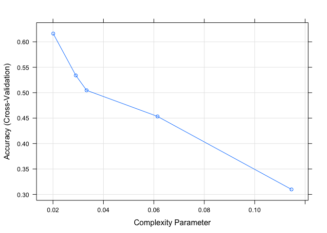
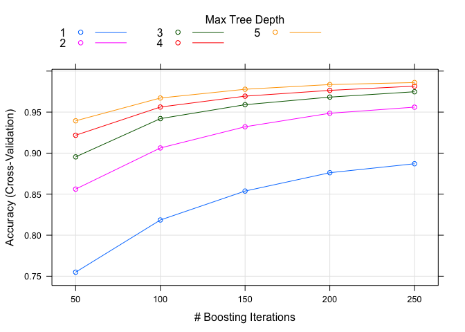
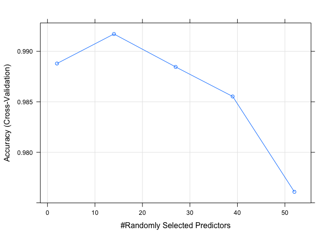

&nbsp;
&nbsp;

## 1. Introduction

With using devices such as *Jawbone Up*, *Nike FuelBand*, and *Fitbit*, etc., a large amount of data about personal activities could be collected for health improvement and exerise patterns/behavior identification, etc. However, it is common to focus on how *much* of  a particular activity people do instead of how *well* they do. Thus, the objective of this project is to predict the manner in which they did the exercise by using the **classe** variable in the given training dataset and to use the prediction model to predict 20 different test cases in the given testing datasets.

&nbsp;
&nbsp;

## 2. Data Preparation and Cleaning

The datasets will be loaded as shown below:


```r
dataset_train <- read.csv('./pml-training.csv', header = TRUE, na.strings = c("NA", "#DIV/0!", ""))
dataset_validate <- read.csv('./pml-testing.csv', header = TRUE, na.strings = c("NA", "#DIV/0!", ""))
```

The dimension of the dataset is:


```r
dim(dataset_train)
```

```
## [1] 19622   160
```

The columns of the training dataset are:


```r
names(dataset_train)
```

```
##   [1] "X"                        "user_name"               
##   [3] "raw_timestamp_part_1"     "raw_timestamp_part_2"    
##   [5] "cvtd_timestamp"           "new_window"              
##   [7] "num_window"               "roll_belt"               
##   [9] "pitch_belt"               "yaw_belt"                
##  [11] "total_accel_belt"         "kurtosis_roll_belt"      
##  [13] "kurtosis_picth_belt"      "kurtosis_yaw_belt"       
##  [15] "skewness_roll_belt"       "skewness_roll_belt.1"    
##  [17] "skewness_yaw_belt"        "max_roll_belt"           
##  [19] "max_picth_belt"           "max_yaw_belt"            
##  [21] "min_roll_belt"            "min_pitch_belt"          
##  [23] "min_yaw_belt"             "amplitude_roll_belt"     
##  [25] "amplitude_pitch_belt"     "amplitude_yaw_belt"      
##  [27] "var_total_accel_belt"     "avg_roll_belt"           
##  [29] "stddev_roll_belt"         "var_roll_belt"           
##  [31] "avg_pitch_belt"           "stddev_pitch_belt"       
##  [33] "var_pitch_belt"           "avg_yaw_belt"            
##  [35] "stddev_yaw_belt"          "var_yaw_belt"            
##  [37] "gyros_belt_x"             "gyros_belt_y"            
##  [39] "gyros_belt_z"             "accel_belt_x"            
##  [41] "accel_belt_y"             "accel_belt_z"            
##  [43] "magnet_belt_x"            "magnet_belt_y"           
##  [45] "magnet_belt_z"            "roll_arm"                
##  [47] "pitch_arm"                "yaw_arm"                 
##  [49] "total_accel_arm"          "var_accel_arm"           
##  [51] "avg_roll_arm"             "stddev_roll_arm"         
##  [53] "var_roll_arm"             "avg_pitch_arm"           
##  [55] "stddev_pitch_arm"         "var_pitch_arm"           
##  [57] "avg_yaw_arm"              "stddev_yaw_arm"          
##  [59] "var_yaw_arm"              "gyros_arm_x"             
##  [61] "gyros_arm_y"              "gyros_arm_z"             
##  [63] "accel_arm_x"              "accel_arm_y"             
##  [65] "accel_arm_z"              "magnet_arm_x"            
##  [67] "magnet_arm_y"             "magnet_arm_z"            
##  [69] "kurtosis_roll_arm"        "kurtosis_picth_arm"      
##  [71] "kurtosis_yaw_arm"         "skewness_roll_arm"       
##  [73] "skewness_pitch_arm"       "skewness_yaw_arm"        
##  [75] "max_roll_arm"             "max_picth_arm"           
##  [77] "max_yaw_arm"              "min_roll_arm"            
##  [79] "min_pitch_arm"            "min_yaw_arm"             
##  [81] "amplitude_roll_arm"       "amplitude_pitch_arm"     
##  [83] "amplitude_yaw_arm"        "roll_dumbbell"           
##  [85] "pitch_dumbbell"           "yaw_dumbbell"            
##  [87] "kurtosis_roll_dumbbell"   "kurtosis_picth_dumbbell" 
##  [89] "kurtosis_yaw_dumbbell"    "skewness_roll_dumbbell"  
##  [91] "skewness_pitch_dumbbell"  "skewness_yaw_dumbbell"   
##  [93] "max_roll_dumbbell"        "max_picth_dumbbell"      
##  [95] "max_yaw_dumbbell"         "min_roll_dumbbell"       
##  [97] "min_pitch_dumbbell"       "min_yaw_dumbbell"        
##  [99] "amplitude_roll_dumbbell"  "amplitude_pitch_dumbbell"
## [101] "amplitude_yaw_dumbbell"   "total_accel_dumbbell"    
## [103] "var_accel_dumbbell"       "avg_roll_dumbbell"       
## [105] "stddev_roll_dumbbell"     "var_roll_dumbbell"       
## [107] "avg_pitch_dumbbell"       "stddev_pitch_dumbbell"   
## [109] "var_pitch_dumbbell"       "avg_yaw_dumbbell"        
## [111] "stddev_yaw_dumbbell"      "var_yaw_dumbbell"        
## [113] "gyros_dumbbell_x"         "gyros_dumbbell_y"        
## [115] "gyros_dumbbell_z"         "accel_dumbbell_x"        
## [117] "accel_dumbbell_y"         "accel_dumbbell_z"        
## [119] "magnet_dumbbell_x"        "magnet_dumbbell_y"       
## [121] "magnet_dumbbell_z"        "roll_forearm"            
## [123] "pitch_forearm"            "yaw_forearm"             
## [125] "kurtosis_roll_forearm"    "kurtosis_picth_forearm"  
## [127] "kurtosis_yaw_forearm"     "skewness_roll_forearm"   
## [129] "skewness_pitch_forearm"   "skewness_yaw_forearm"    
## [131] "max_roll_forearm"         "max_picth_forearm"       
## [133] "max_yaw_forearm"          "min_roll_forearm"        
## [135] "min_pitch_forearm"        "min_yaw_forearm"         
## [137] "amplitude_roll_forearm"   "amplitude_pitch_forearm" 
## [139] "amplitude_yaw_forearm"    "total_accel_forearm"     
## [141] "var_accel_forearm"        "avg_roll_forearm"        
## [143] "stddev_roll_forearm"      "var_roll_forearm"        
## [145] "avg_pitch_forearm"        "stddev_pitch_forearm"    
## [147] "var_pitch_forearm"        "avg_yaw_forearm"         
## [149] "stddev_yaw_forearm"       "var_yaw_forearm"         
## [151] "gyros_forearm_x"          "gyros_forearm_y"         
## [153] "gyros_forearm_z"          "accel_forearm_x"         
## [155] "accel_forearm_y"          "accel_forearm_z"         
## [157] "magnet_forearm_x"         "magnet_forearm_y"        
## [159] "magnet_forearm_z"         "classe"
```

Columns with *all* values **NA** will be removed as shown below.


```r
data_train <- dataset_train[,colSums(is.na(dataset_train)) == 0]
data_validate <- dataset_validate[,colSums(is.na(dataset_validate)) == 0]
```

The first 7 columns will be removed as shown below because they are not related to the model building.


```r
data_train <- data_train[,-c(1:7)]
data_validate <- data_validate[,-c(1:7)]
```

Dataset for model building/training after data cleaning becomes:


```r
str(data_train)
```

```
## 'data.frame':	19622 obs. of  53 variables:
##  $ roll_belt           : num  1.41 1.41 1.42 1.48 1.48 1.45 1.42 1.42 1.43 1.45 ...
##  $ pitch_belt          : num  8.07 8.07 8.07 8.05 8.07 8.06 8.09 8.13 8.16 8.17 ...
##  $ yaw_belt            : num  -94.4 -94.4 -94.4 -94.4 -94.4 -94.4 -94.4 -94.4 -94.4 -94.4 ...
##  $ total_accel_belt    : int  3 3 3 3 3 3 3 3 3 3 ...
##  $ gyros_belt_x        : num  0 0.02 0 0.02 0.02 0.02 0.02 0.02 0.02 0.03 ...
##  $ gyros_belt_y        : num  0 0 0 0 0.02 0 0 0 0 0 ...
##  $ gyros_belt_z        : num  -0.02 -0.02 -0.02 -0.03 -0.02 -0.02 -0.02 -0.02 -0.02 0 ...
##  $ accel_belt_x        : int  -21 -22 -20 -22 -21 -21 -22 -22 -20 -21 ...
##  $ accel_belt_y        : int  4 4 5 3 2 4 3 4 2 4 ...
##  $ accel_belt_z        : int  22 22 23 21 24 21 21 21 24 22 ...
##  $ magnet_belt_x       : int  -3 -7 -2 -6 -6 0 -4 -2 1 -3 ...
##  $ magnet_belt_y       : int  599 608 600 604 600 603 599 603 602 609 ...
##  $ magnet_belt_z       : int  -313 -311 -305 -310 -302 -312 -311 -313 -312 -308 ...
##  $ roll_arm            : num  -128 -128 -128 -128 -128 -128 -128 -128 -128 -128 ...
##  $ pitch_arm           : num  22.5 22.5 22.5 22.1 22.1 22 21.9 21.8 21.7 21.6 ...
##  $ yaw_arm             : num  -161 -161 -161 -161 -161 -161 -161 -161 -161 -161 ...
##  $ total_accel_arm     : int  34 34 34 34 34 34 34 34 34 34 ...
##  $ gyros_arm_x         : num  0 0.02 0.02 0.02 0 0.02 0 0.02 0.02 0.02 ...
##  $ gyros_arm_y         : num  0 -0.02 -0.02 -0.03 -0.03 -0.03 -0.03 -0.02 -0.03 -0.03 ...
##  $ gyros_arm_z         : num  -0.02 -0.02 -0.02 0.02 0 0 0 0 -0.02 -0.02 ...
##  $ accel_arm_x         : int  -288 -290 -289 -289 -289 -289 -289 -289 -288 -288 ...
##  $ accel_arm_y         : int  109 110 110 111 111 111 111 111 109 110 ...
##  $ accel_arm_z         : int  -123 -125 -126 -123 -123 -122 -125 -124 -122 -124 ...
##  $ magnet_arm_x        : int  -368 -369 -368 -372 -374 -369 -373 -372 -369 -376 ...
##  $ magnet_arm_y        : int  337 337 344 344 337 342 336 338 341 334 ...
##  $ magnet_arm_z        : int  516 513 513 512 506 513 509 510 518 516 ...
##  $ roll_dumbbell       : num  13.1 13.1 12.9 13.4 13.4 ...
##  $ pitch_dumbbell      : num  -70.5 -70.6 -70.3 -70.4 -70.4 ...
##  $ yaw_dumbbell        : num  -84.9 -84.7 -85.1 -84.9 -84.9 ...
##  $ total_accel_dumbbell: int  37 37 37 37 37 37 37 37 37 37 ...
##  $ gyros_dumbbell_x    : num  0 0 0 0 0 0 0 0 0 0 ...
##  $ gyros_dumbbell_y    : num  -0.02 -0.02 -0.02 -0.02 -0.02 -0.02 -0.02 -0.02 -0.02 -0.02 ...
##  $ gyros_dumbbell_z    : num  0 0 0 -0.02 0 0 0 0 0 0 ...
##  $ accel_dumbbell_x    : int  -234 -233 -232 -232 -233 -234 -232 -234 -232 -235 ...
##  $ accel_dumbbell_y    : int  47 47 46 48 48 48 47 46 47 48 ...
##  $ accel_dumbbell_z    : int  -271 -269 -270 -269 -270 -269 -270 -272 -269 -270 ...
##  $ magnet_dumbbell_x   : int  -559 -555 -561 -552 -554 -558 -551 -555 -549 -558 ...
##  $ magnet_dumbbell_y   : int  293 296 298 303 292 294 295 300 292 291 ...
##  $ magnet_dumbbell_z   : num  -65 -64 -63 -60 -68 -66 -70 -74 -65 -69 ...
##  $ roll_forearm        : num  28.4 28.3 28.3 28.1 28 27.9 27.9 27.8 27.7 27.7 ...
##  $ pitch_forearm       : num  -63.9 -63.9 -63.9 -63.9 -63.9 -63.9 -63.9 -63.8 -63.8 -63.8 ...
##  $ yaw_forearm         : num  -153 -153 -152 -152 -152 -152 -152 -152 -152 -152 ...
##  $ total_accel_forearm : int  36 36 36 36 36 36 36 36 36 36 ...
##  $ gyros_forearm_x     : num  0.03 0.02 0.03 0.02 0.02 0.02 0.02 0.02 0.03 0.02 ...
##  $ gyros_forearm_y     : num  0 0 -0.02 -0.02 0 -0.02 0 -0.02 0 0 ...
##  $ gyros_forearm_z     : num  -0.02 -0.02 0 0 -0.02 -0.03 -0.02 0 -0.02 -0.02 ...
##  $ accel_forearm_x     : int  192 192 196 189 189 193 195 193 193 190 ...
##  $ accel_forearm_y     : int  203 203 204 206 206 203 205 205 204 205 ...
##  $ accel_forearm_z     : int  -215 -216 -213 -214 -214 -215 -215 -213 -214 -215 ...
##  $ magnet_forearm_x    : int  -17 -18 -18 -16 -17 -9 -18 -9 -16 -22 ...
##  $ magnet_forearm_y    : num  654 661 658 658 655 660 659 660 653 656 ...
##  $ magnet_forearm_z    : num  476 473 469 469 473 478 470 474 476 473 ...
##  $ classe              : chr  "A" "A" "A" "A" ...
```

&nbsp;
&nbsp;

## 3. Model Building

The library **caret** will be loaded as shown below for model building:


```r
library("caret")
```

```
## Loading required package: lattice
```

```
## Loading required package: ggplot2
```

&nbsp;

The original train dataset, **data_train**, will be partitioned into 2 datasets which are train dataset and test dataset, respectively, for model training and testing as shown below:


```r
set.seed(20210101)
samples_partition <- createDataPartition(y=data_train$classe, p=0.75, list=FALSE)
samples_train <- data_train[samples_partition,]
samples_test <- data_train[-samples_partition,]
```

&nbsp;

Models Decision Tree, Generalized Boosted Regression Model and Random Forest are considered and 3-fold cross validation will be used.


```r
train_control <- trainControl(method = "cv", number = 3, verboseIter = FALSE)
```

&nbsp;

### 3.1 Decision Tree

The Decision Tree model will be trained, predicted and tested as follows:


```r
model_dt <- train(classe ~ ., data = samples_train, trControl = train_control, tuneLength = 5, method = "rpart")
predict_dt <- predict(model_dt, newdata = samples_test)
cm_dt <- confusionMatrix(predict_dt, factor(samples_test$classe))
```

```r
cm_dt
```

```
## Confusion Matrix and Statistics
## 
##           Reference
## Prediction    A    B    C    D    E
##          A 1263  414  415  366  124
##          B   21  277   28   10  109
##          C   83  203  330  110  197
##          D   26   55   82  318   59
##          E    2    0    0    0  412
## 
## Overall Statistics
##                                           
##                Accuracy : 0.5302          
##                  95% CI : (0.5161, 0.5442)
##     No Information Rate : 0.2845          
##     P-Value [Acc > NIR] : < 2.2e-16       
##                                           
##                   Kappa : 0.3869          
##                                           
##  Mcnemar's Test P-Value : < 2.2e-16       
## 
## Statistics by Class:
## 
##                      Class: A Class: B Class: C Class: D Class: E
## Sensitivity            0.9054  0.29189  0.38596  0.39552  0.45727
## Specificity            0.6241  0.95752  0.85354  0.94585  0.99950
## Pos Pred Value         0.4892  0.62247  0.35753  0.58889  0.99517
## Neg Pred Value         0.9432  0.84929  0.86812  0.88863  0.89109
## Prevalence             0.2845  0.19352  0.17435  0.16395  0.18373
## Detection Rate         0.2575  0.05648  0.06729  0.06485  0.08401
## Detection Prevalence   0.5265  0.09074  0.18821  0.11011  0.08442
## Balanced Accuracy      0.7647  0.62470  0.61975  0.67069  0.72839
```

&nbsp;

### 3.2 Generalized Boosted Regression Model

The Generalized Boosted Regression Model will be trained, predicted and tested as follows:


```r
model_gbm <- train(classe ~ ., data = samples_train, trControl = train_control, tuneLength = 5, method = "gbm")
predict_gbm <- predict(model_gbm, newdata = samples_test)
cm_gbm <- confusionMatrix(predict_gbm, factor(samples_test$classe))
```

```r
cm_gbm
```

```
## Confusion Matrix and Statistics
## 
##           Reference
## Prediction    A    B    C    D    E
##          A 1389    8    0    0    0
##          B    3  939   10    0    3
##          C    2    2  839    9    4
##          D    0    0    6  795    1
##          E    1    0    0    0  893
## 
## Overall Statistics
##                                           
##                Accuracy : 0.99            
##                  95% CI : (0.9868, 0.9926)
##     No Information Rate : 0.2845          
##     P-Value [Acc > NIR] : < 2.2e-16       
##                                           
##                   Kappa : 0.9874          
##                                           
##  Mcnemar's Test P-Value : NA              
## 
## Statistics by Class:
## 
##                      Class: A Class: B Class: C Class: D Class: E
## Sensitivity            0.9957   0.9895   0.9813   0.9888   0.9911
## Specificity            0.9977   0.9960   0.9958   0.9983   0.9998
## Pos Pred Value         0.9943   0.9832   0.9801   0.9913   0.9989
## Neg Pred Value         0.9983   0.9975   0.9960   0.9978   0.9980
## Prevalence             0.2845   0.1935   0.1743   0.1639   0.1837
## Detection Rate         0.2832   0.1915   0.1711   0.1621   0.1821
## Detection Prevalence   0.2849   0.1947   0.1746   0.1635   0.1823
## Balanced Accuracy      0.9967   0.9927   0.9885   0.9935   0.9954
```

&nbsp;

### 3.3 Random Forest

The Random Forest will be trained, predicted and tested as follows:


```r
model_rf <- train(classe ~ ., data = samples_train, trControl = train_control, tuneLength = 5, method = "rf")
predict_rf <- predict(model_rf, newdata = samples_test)
cm_rf <- confusionMatrix(predict_rf, factor(samples_test$classe))
```

```r
cm_rf
```

```
## Confusion Matrix and Statistics
## 
##           Reference
## Prediction    A    B    C    D    E
##          A 1395    7    0    0    0
##          B    0  942    3    0    0
##          C    0    0  850    4    0
##          D    0    0    2  800    0
##          E    0    0    0    0  901
## 
## Overall Statistics
##                                           
##                Accuracy : 0.9967          
##                  95% CI : (0.9947, 0.9981)
##     No Information Rate : 0.2845          
##     P-Value [Acc > NIR] : < 2.2e-16       
##                                           
##                   Kappa : 0.9959          
##                                           
##  Mcnemar's Test P-Value : NA              
## 
## Statistics by Class:
## 
##                      Class: A Class: B Class: C Class: D Class: E
## Sensitivity            1.0000   0.9926   0.9942   0.9950   1.0000
## Specificity            0.9980   0.9992   0.9990   0.9995   1.0000
## Pos Pred Value         0.9950   0.9968   0.9953   0.9975   1.0000
## Neg Pred Value         1.0000   0.9982   0.9988   0.9990   1.0000
## Prevalence             0.2845   0.1935   0.1743   0.1639   0.1837
## Detection Rate         0.2845   0.1921   0.1733   0.1631   0.1837
## Detection Prevalence   0.2859   0.1927   0.1741   0.1635   0.1837
## Balanced Accuracy      0.9990   0.9959   0.9966   0.9973   1.0000
```

&nbsp;

### 3.4 Comparison of the Model's Accuracy


```r
model_accuracy <- data.frame(Model = c("Decision Tree", "Generalized Boosted Regression Model", "Random Forest"), 
                             Accuracy = rbind(cm_dt$overall[1], cm_gbm$overall[1], cm_rf$overall[1]))
print(model_accuracy)
```

```
##                                  Model  Accuracy
## 1                        Decision Tree 0.5301794
## 2 Generalized Boosted Regression Model 0.9900082
## 3                        Random Forest 0.9967374
```


&nbsp;
&nbsp;

## 4. Conclusion

According to the accuracy of the confusion matrices between Decision Tree, Generalized Boosted Regression Model and Random Forest, it is found that the accuracy of Random Forest is the highest which is 0.9967 (95% CI: (0.9947, 0.9981)) and corresponding expected out-of-samples error is 0.0033. Therefore, Random Forest will be chosen as the prediction model.

With using Random Forests, the prediction of the given testing dataset **pml-testing.csv** is


```r
predict_validate <- predict(model_rf, newdata = data_validate)
predict_validate
```

```
##  [1] B A B A A E D B A A B C B A E E A B B B
## Levels: A B C D E
```

&nbsp;
&nbsp;

## 5. Appendix

### 5.1 Plot for Decision Tree


```r
plot(model_dt)
```

<!-- -->

&nbsp;

### 5.2 Plot for Generalized Boosted Regression Model


```r
plot(model_gbm)
```

<!-- -->

&nbsp;

### 5.3 Plot for Random Forest


```r
plot(model_rf)
```

<!-- -->
